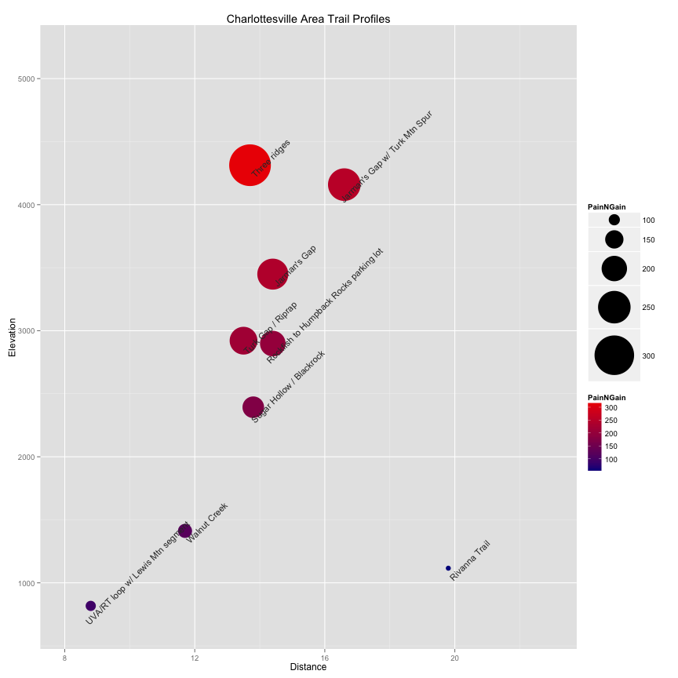

# Charlottesville Area Trail Profiles

This is an R Markdown document. Markdown is a simple formatting syntax for authoring web pages (click the **MD** toolbar button for help on Markdown).

When you click the **Knit HTML** button a web page will be generated that includes both content as well as the output of any embedded R code chunks within the document. You can embed an R code chunk like this:


```R
library(ggplot2)

trailprofile <- read.csv("trailprofile.csv", header = TRUE, stringsAsFactors = FALSE)
trailprofile <- transform(trailprofile, PainNGain = Elevation/Distance)

p <- ggplot(data = trailprofile, aes(Distance, Elevation, label = Route)) + 
    geom_point(aes(colour = PainNGain, size = PainNGain)) + scale_size(range = c(3, 
    25)) + scale_colour_continuous(low = "blue4", high = "red2")
p <- p + geom_text(size = 4, angle = 45, vjust = 2, hjust = 0.1, colour = "gray20")
p <- p + scale_x_continuous(limits = c(8, 23)) + scale_y_continuous(limits = c(700, 
    5200))
p <- p + labs(title = "Charlottesville Area Trail Profiles")
```


Embedded plot


```R
print(p)
```

 


