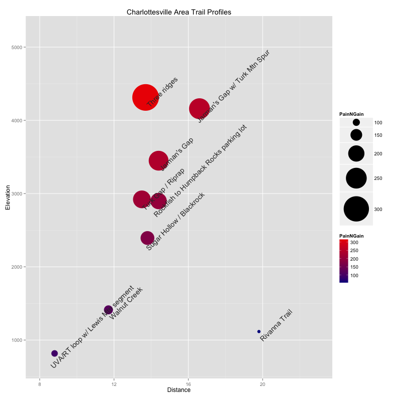

# Charlottesville Area Trail Profiles


R code


```
library(ggplot2)

trailprofile <- read.csv("trailprofile.csv", header = TRUE, stringsAsFactors = FALSE)
trailprofile <- transform(trailprofile, PainNGain = Elevation/Distance)

p <- ggplot(data = trailprofile, aes(Distance, Elevation, label = Route)) + 
    geom_point(aes(colour = PainNGain, size = PainNGain)) + scale_size(range = c(3, 
    25)) + scale_colour_continuous(low = "blue4", high = "red2")
p <- p + geom_text(size = 5, angle = 45, vjust = 2, hjust = 0.1, colour = "gray20")
p <- p + scale_x_continuous(limits = c(8, 23))
p <- p + scale_y_continuous(limits = c(700, 5200))
p <- p + labs(title = "Charlottesville Area Trail Profiles")
```


Table: 

Route | Link | Elevation | Distance | PainNGain
--- | --- | --- | --- | ---
Rivanna Trail | http://app.strava.com/activities/32493109 | 1116 | 19.8 |  56.36
UVA/RT loop w/ Lewis Mtn segment | http://app.strava.com/activities/67987751 |  817 |  8.8 |  92.84
Walnut Creek | http://app.strava.com/activities/70205315 | 1412 | 11.7 | 120.68
Sugar Hollow / Blackrock | http://app.strava.com/activities/56684464 | 2393 | 13.8 | 173.41
Rockfish to Humpback Rocks parking lot | http://app.strava.com/activities/70913996 | 2898 | 14.4 | 201.25
Jarman's Gap | http://app.strava.com/activities/58992224 | 3449 | 14.4 | 239.51
Jarman's Gap w/ Turk Mtn Spur | http://app.strava.com/activities/28118499 | 4159 | 16.6 | 250.54
Turk Gap / Riprap | http://app.strava.com/activities/62558977 | 2921 | 13.5 | 216.37
Three ridges | http://app.strava.com/activities/30484879 | 4313 | 13.7 | 314.82


Figure lorem ipsum


```
print(p)
```

 


